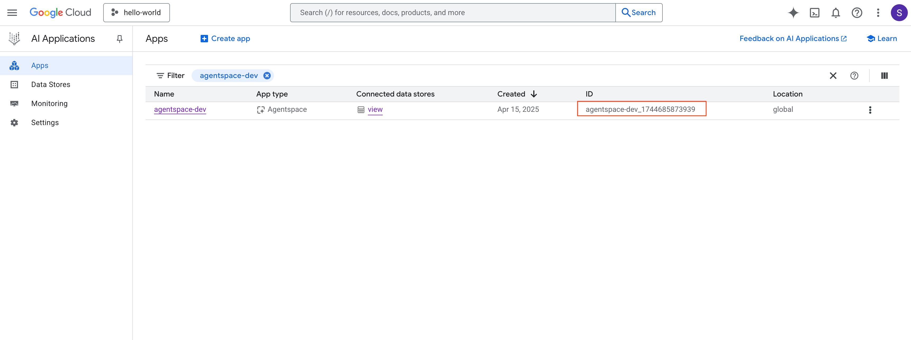
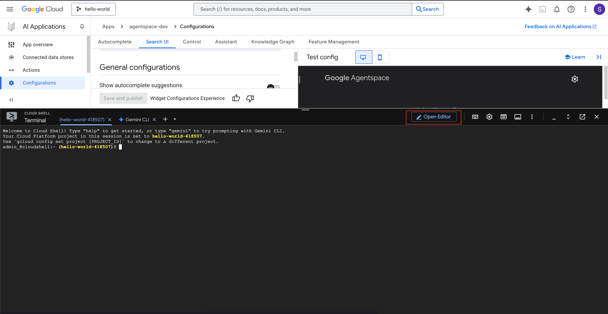
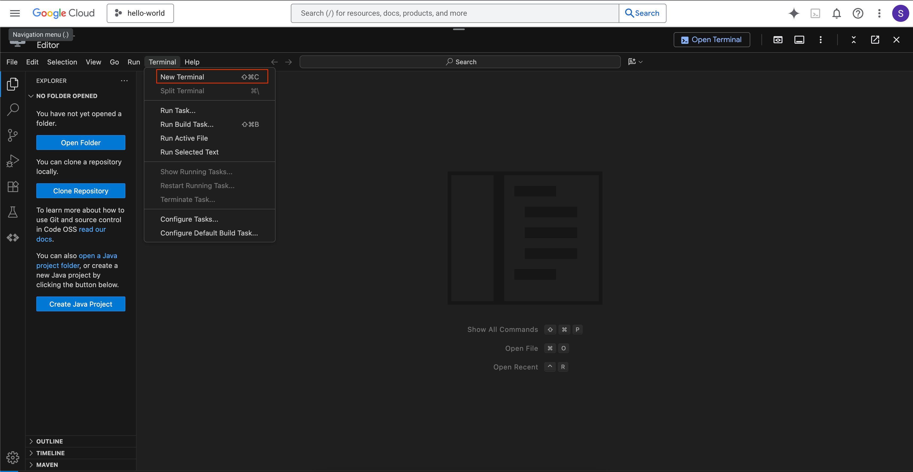
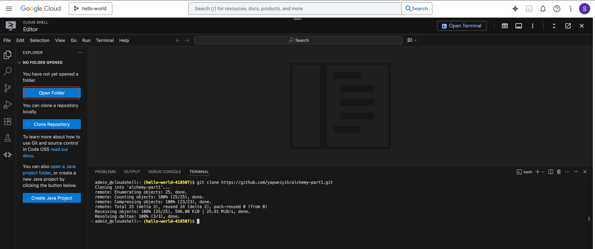
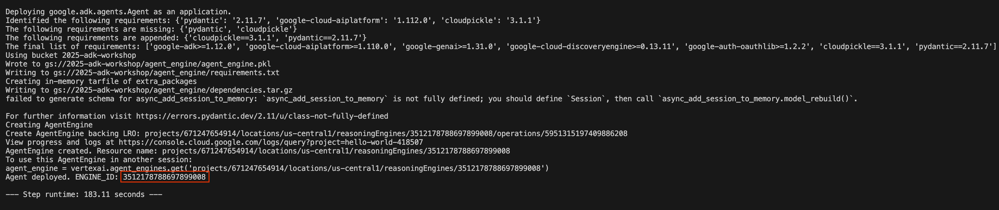

# Deploy Custom ADK Agent to Agentspace with authentication support.

## Repository Objective

This repository provides a complete solution for deploying custom ADK (Agent Development Kit) agents to Google Cloud's Agentspace platform with built-in authentication support. The primary goal is to enable developers to create, deploy, and register custom AI agents that can authenticate users via OAuth2 (using personal email accounts) and perform authorized actions on their behalf, such as accessing user information and sending emails. The repository streamlines the entire deployment pipeline from initial setup in Google Cloud Shell to final registration and testing in Agentspace.

## File Structure

The repository is organized into the following structure:
```text
.
├── auth_agent
│   ├── ae_deploy.py
│   ├── create_oauth_uri.py
│   ├── delete_agent.sh
│   ├── download_logs.py
│   ├── auth_agent
│   │   ├── __init__.py
│   │   └── agent.py
│   ├── pyproject.toml
│   ├── register.sh
│   └── uv.lock
├── assets
│   ├── app_id.png
│   ├── cloudshell.png
│   ├── engine_id.png
│   ├── open_folder.png
│   ├── register.png
│   └── terminal.png
└── README.md
```

### Root Level Files:
- **`README.md`** - Main documentation with step-by-step deployment instructions

### `/auth_agent/` Directory:

**Core Files:**
- **`ae_deploy.py`** - Python script for deploying the ADK agent to Agent Engine
- **`create_oauth_uri.py`** - Python script for generating OAuth authorization URI and storing it in .env
- **`delete_agent.sh`** - Shell script for deleting existing agent and authentication ID from Agentspace
- **`download_logs.py`** - Python script for downloading and analyzing GCP Cloud Logging logs from deployed Reasoning Engine
- **`register.sh`** - Shell script for registering agent with Agentspace and managing authentication

**Python Virtual Environment:**
- **`pyproject.toml`** - Python project configuration and dependencies
- **`uv.lock`** - Lock file for UV package manager dependencies

**`/auth_agent/auth_agent/` ADK Agent directory:**
- **`__init__.py`** - Python package initialization file
- **`agent.py`** - ADK agent implementation with authentication and email sending capabilities


## Prerequisites
- Create agentspace OAuth 2.0 credentials using GCP Auth Platform for `Web Application` type. Download the JSON file.

- Store the credentials in Google Secret Manager (you need all three):
  - Store the entire JSON file content with key `AGENTSPACE_WEB_SECRET_JSON` (used by `create_oauth_uri.py`)
  - Store just the Client ID with key `AGENTSPACE_WEB_CLIENTID` (used by `register.sh`)
  - Store just the Client Secret with key `AGENTSPACE_WEB_CLIENTSECRET` (used by `register.sh`)

- Manually create Reasoning Enginer service account.
```bash
gcloud beta services identity create --service=aiplatform.googleapis.com --project=PROJECT_ID
```

- Go to IAM, grant Reasoning Engine service account permission `secretmanager.versions.access`.

- Choose a unique name for authentication id, say `AUTH_ID=agentspace-lab1-auth-id`.

- Create new Agentspace app using console, say `APP_ID=agentspace-dev_1744685873939`.


- [TODO - automate] Create a GCS bucket name of your choice, say `STAGING_BUCKET=gs://2025-adk-workshop`.

- Create a `.env` file in the `auth_agent` directory with all the required environment variables (see Part 0 below).


## Setup
- Open Cloud Shell, and click "Open Editor".



- Open a terminal and then git clone the repo by running `git clone https://github.com/yapweiyih/alchemy-part1.git`.



- Open the repo folder `alchemy-part1`.



## Part 0 - Create and Update .env file
- Create a `.env` file in the `auth_agent` directory
- Update the .env file with your project-specific values. It should look as follows:

```bash
GOOGLE_CLOUD_PROJECT=hello-world-418507
GOOGLE_CLOUD_LOCATION=us-central1
GOOGLE_GENAI_USE_VERTEXAI=1
DISPLAY_NAME=agentspace-lab1
APP_ID=agentspace-dev_1744685873939
AUTH_ID=agentspace-lab1-auth-id
STAGING_BUCKET=gs://2025-adk-workshop
```

## Part 1 - Deploy ADK Agent to Agent Engine
- Change directory `cd auth_agent`
- Run `uv run ae_deploy.py`, this may take about 3mins.
- Once it is done, you will get a Reasoning `ENGINE_ID` as shown below.

- Update the ENGINE_ID into .env manually
```bash
GOOGLE_CLOUD_PROJECT=hello-world-418507
GOOGLE_CLOUD_LOCATION=us-central1
GOOGLE_GENAI_USE_VERTEXAI=1
DISPLAY_NAME=agentspace-lab1
APP_ID=agentspace-dev_1744685873939
AUTH_ID=agentspace-lab1-auth-id
STAGING_BUCKET=gs://2025-adk-workshop
ENGINE_ID=4256345850562740224
```

## Part 2 - Generate OAuth Authorization URI
- Run `uv run create_oauth_uri.py`
- This will generate the OAuth authorization URI and append it to the .env file.
- Now your .env file should have a new entry `OAUTH_AUTH_URI`

```bash
GOOGLE_CLOUD_PROJECT=hello-world-418507
GOOGLE_CLOUD_LOCATION=us-central1
GOOGLE_GENAI_USE_VERTEXAI=1
DISPLAY_NAME=agentspace-lab1
APP_ID=agentspace-dev_1744685873939
AUTH_ID=agentspace-lab1-auth-id
STAGING_BUCKET=gs://2025-adk-workshop
ENGINE_ID=4256345850562740224
OAUTH_AUTH_URI=...
```

## Part 3 - Register with Agentspace
- Run `bash register.sh create-auth` to create Agentspace authentication configuration. Make sure you see success message `HTTP Status Code: 200`.
- Run `bash register.sh register-auth` to register ADK custom agent to Agentspace with authentication enabled. Make sure you see success message `"state": "ENABLED"`.
- Go to your Agentspace homepage, click Agents on the left menu, and click refresh.
- Now you should be able to see your custom ADK agent named `agentspace-lab1`.


## Part 4 - Test the ADK Agent
- When you open the `agentspace-lab1`, you will be asked to login to your email to authenticate
- Authenticate with your email.
- Enter "Check authentication"
- Enter "Send email to weiyih@google.com, subject: agentspace test, body: testing"


# Troubleshooting

## Downloading and Analyzing Logs

The `download_logs.py` script helps you debug and monitor your deployed ADK agent by downloading logs from GCP Cloud Logging.

### Basic Usage
```bash
cd auth_agent
uv run download_logs.py
```

### Command-Line Options
- `--project-id` - GCP project ID (default: hello-world-418507)
- `--reasoning-engine-id` - Reasoning Engine ID (default: 8904095850381180928)
- `--location` - GCP location (default: us-central1)
- `--minutes` - Number of minutes to look back (default: 360)
- `--output-dir` - Output directory for JSON file (default: logs)

### Example Usage
```bash
# Download logs from the last 10 hours
uv run download_logs.py --minutes 600

# Download logs for a specific Reasoning Engine
uv run download_logs.py --reasoning-engine-id 7957944104447377408

# Specify custom output directory
uv run download_logs.py --output-dir ./my-logs
```

### Output
The script will:
1. Query GCP Cloud Logging for the specified time range
2. Extract textPayload fields from log entries
3. Save results to a timestamped JSON file (e.g., `downloaded-logs-20250121-173000.json`)
4. Print all text payloads to stdout for quick review

This is particularly useful for:
- Debugging agent execution issues
- Monitoring agent behavior in production
- Reviewing historical agent interactions
- Troubleshooting authentication problems

## Delete and Re-register Agent
If you encounter issues and need to start over:
- Run `bash delete_agent.sh` to delete both the Agentspace agent and authentication configuration
- Then repeat Part 3 to register again

## Available Commands in register.sh
The `register.sh` script supports the following commands:
- `register` - Register agent without authentication
- `register-auth` - Register agent with authentication
- `create-auth` - Create authentication configuration
- `delete-auth` - Delete authentication configuration
- `list [name]` - List all agents or filter by name
- `delete <AGENT_ID>` - Delete a specific agent
- `update <AGENT_ID>` - Update an existing agent
- `update-auth <AGENT_ID>` - Update an agent with authentication
